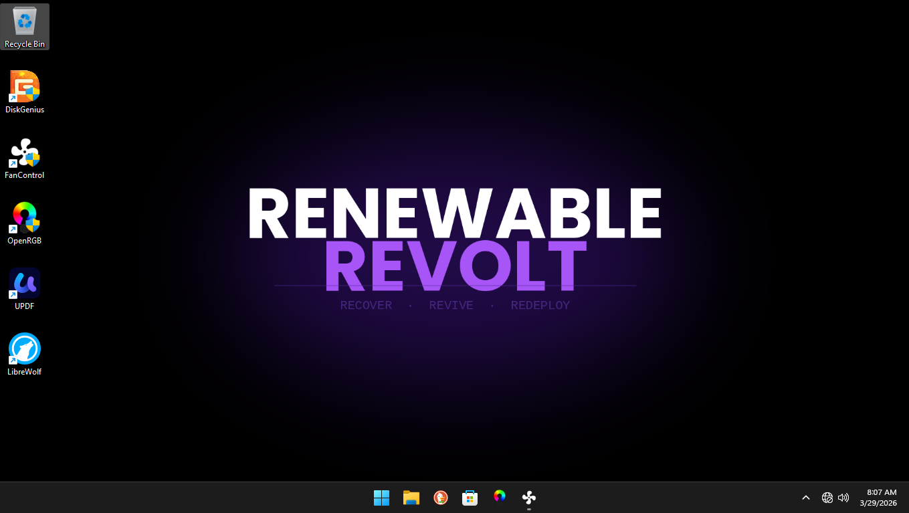
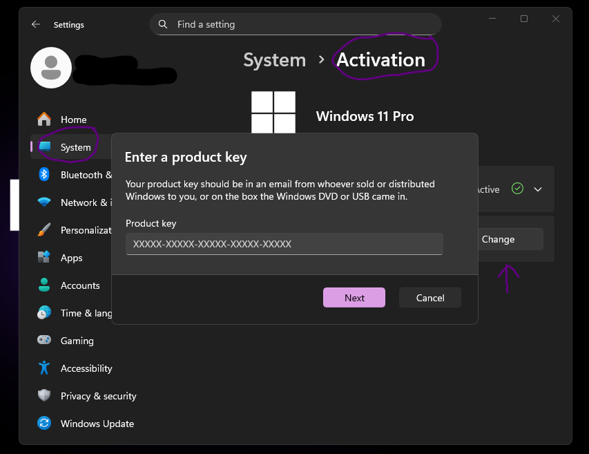
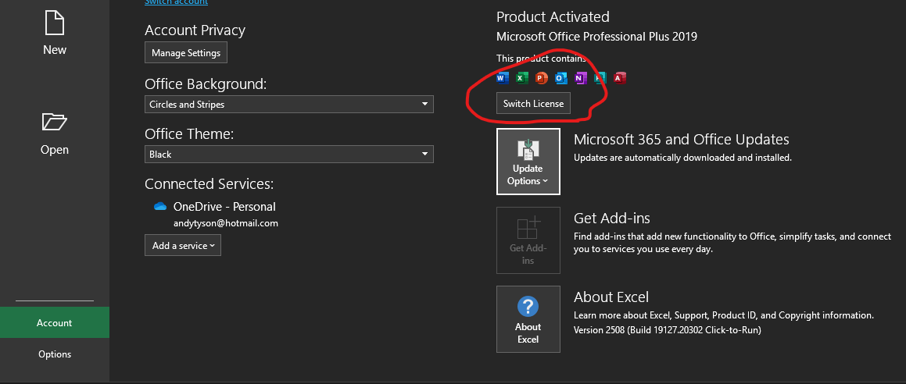

# R-R-Turbo

**Privacy-first, debloated Windows 11 Pro image** designed to breathe life back into older hardware — while delivering a noticeable performance boost on virtually any machine running Windows 11.

It strips telemetry, Copilot, Recall, Edge bloat, and Microsoft lock-in at the **ISO level** — so future updates cannot restore what was never shipped. The result: fewer background processes, dramatically lower RAM usage, and resources that stay where they belong.

Built and maintained by [Renewable Revolt](https://renewablerevolt.org/), a veteran-owned 501(c)(3) nonprofit (EIN 99-2777606) dedicated to recovering e-waste, reviving hardware, and redeploying privacy-focused systems. Stable in production for 9+ months.

## Features

- 48% fewer background processes
- 35% more available RAM headroom
- No subscriptions, no surveillance, no AI features
- Pre-installed and configured for long-term stability on legacy hardware (X99, X79, Coffee Lake, etc.)

## Pre-installed Software

The following programs are chosen intentionally for **maximum performance + maximum productivity** on older and low-resource hardware:

- DuckDuckGo Browser (default)
- LibreWolf (hardened with uBlock Origin)
- Office 2019 Pro Plus (unactivated)
- Fan Control
- OpenRGB
- uPDF
- **DiskGenius Free** — powerful partition management, imaging, and recovery tool (we use this internally at Renewable Revolt; feel free to uninstall if you don't need it)

**Graphics driver tools** (included in the Downloads folder for post-install use):
- **NVCleanstall** — Lightweight NVIDIA driver installer that removes telemetry and bloat (attribution: [TechPowerUp NVCleanstall](https://www.techpowerup.com/nvcleanstall/))
- **Radeon Software Slimmer** — Tool to slim down AMD Radeon Software (attribution: original project on GitHub)

Users can run DDU in Safe Mode first, then use these tools or download fresh drivers directly from NVIDIA/AMD.

**Minimum recommended specifications** for smooth operation:
- 4-core CPU
- 4 GB RAM
- SSD (SATA III works; NVMe performs best)
- Large paging file (3× RAM for 4 GB systems; 1.5× RAM for 8 GB+)

## What's Removed (Permanent at ISO Level)

**Tiny11 Builder + NTLite layers:**
- Copilot, Recall, all telemetry modules
- Microsoft Edge (including auto-updates)
- Consumer Teams, OneDrive, Xbox apps/Game Bar, Store ads, Start menu web search
- Cortana, Clipchamp, Mail/Calendar, Maps, Weather, News, Tips, Feedback Hub, and most preinstalled consumer apps

**Services & Policies:**
- Telemetry set to Security level
- Driver auto-updates disabled
- Delivery Optimization limited to local network
- Location services, advertising ID, and personal content indexing removed

## Requirements

- Valid **Windows 11 Pro retail license** (not included)
- Valid **Office 2019 Pro Plus license** (not included)
- UEFI boot with Secure Boot optional (works on many non-supported legacy CPUs)

## Installation

1. Download **all** parts of the split archive from the [Releases page](https://github.com/IncRevolt/R-R-Turbo/releases).
2. Place all parts (`RR-Turbo-v6.7z.001`, `.002`, etc.) in the **same folder**.
3. Install [7-Zip](https://www.7-zip.org/) (free).
4. Right-click the **first file** (`RR-Turbo-v6.7z.001`) → **7-Zip** → **Extract Here**.
5. Enter the password if one was set.
6. You will get the full `RR-Turbo-v6.wim` file.

**To create a bootable USB:**
- Use **Rufus** (recommended) — select the `.wim` and write in DD Image mode, or
- Use Ventoy / NTLite to build a full bootable ISO.

**Post-install (Refurbishers):**  
Run DDU in Safe Mode to clean GPU drivers before mass deployment.

## Screenshots

All screenshots taken on the same hardware: **Lenovo IdeaPad 1 14ADA05 (82GW)** — a 2021 budget 14" laptop with:
- **AMD Athlon Silver 3050e** (2C/4T, 1.4–2.8 GHz) — officially supported on Microsoft's Windows 11 CPU compatibility list
- **4 GB soldered DDR4-2400 RAM** (non-upgradable)
- Integrated AMD Radeon Vega 3 graphics

- **Before**: Stock Windows 11 + Office 365 (full Microsoft bloat and telemetry)
- **After**: RR-Turbo v6 + Office 2019 Pro Plus (debloated at ISO level, with LibreWolf, Renewable Revolt Windows theme, and custom Revolt background)

**RR-Turbo v6 Desktop** (LibreWolf as default browser, Renewable Revolt theme and background):

**Additional screenshots:**
- How to activate Windows 11 license
- How to activate Office 2019 license

These comparisons show how RR-Turbo transforms marginal, officially "compatible" hardware from sluggish to responsive while restoring privacy and performance on refurbished and legacy PCs.

## Known Issues

(Full list remains in the README for visibility. Individual issues will be created in the Issues tab.)

## For Refurbishers & Builders

The build methodology (UUP Dump → Tiny11 Builder → NTLite → post-install scripts) is documented in `/docs` (WIP).

## Credits

- Tiny11 Builder (NTDEV), UUP Dump, NTLite
- Fan Control (Rem0o), OpenRGB, LibreWolf
- NVCleanstall (TechPowerUp)
- Radeon Software Slimmer (original project maintainers)
- Renewable Revolt team — extending hardware life, one system at a time.

## About Renewable Revolt

We recover enterprise e-waste, perform secure data destruction, upgrade components, and redeploy affordable, high-performance PCs without bloat or subscriptions. Focused on veterans, students, families, and gamers who refuse planned obsolescence.

Visit [renewablerevolt.org](https://renewablerevolt.org/) to learn more or support the mission.

---

**License**

This repository (methodology, scripts, documentation) is licensed under the [MIT License](LICENSE).  
The Windows image itself is a modified Microsoft product — users must provide their own valid licenses. No Microsoft trademarks or copyrighted material beyond fair use for modification is claimed.
