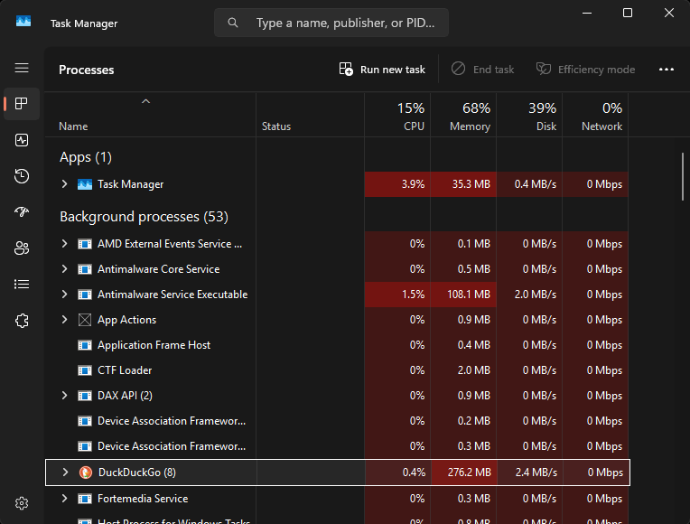
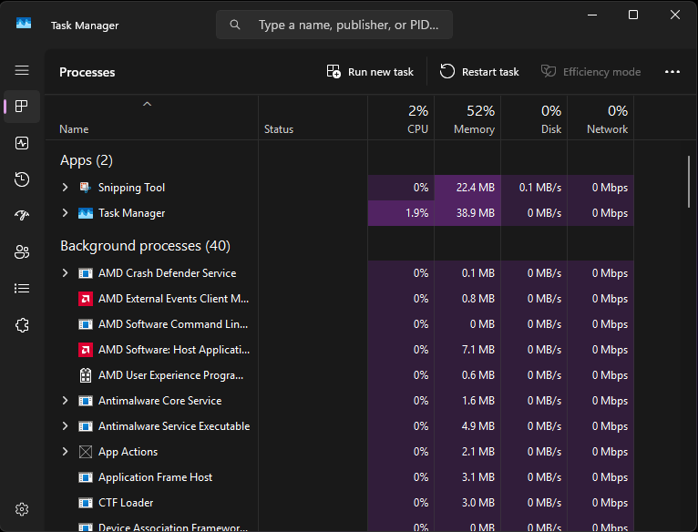

# R-R-Turbo

Debloated Windows 11 Image

# Win 11 Pro [RR Turbo]

### A Privacy-First Windows 11 Pro Image by Renewable Revolt, Incorporated

**Version:** v6  
**Base:** Windows 11 Pro (24H2)  
**Built with:** UUP Dump · Tiny11 Builder (NTDEV) · NTLite · oscdimg (Windows ADK)  
**Status:** Stable — 9+ months production deployment  
**License:** MIT (build methodology and scripts)

---

> *"Reports of this hardware's death were greatly exaggerated."*  
> Renewable Revolt, Inc. · Hammond, Indiana · 501(c)(3) · EIN: 99-2777606  
> [renewablerevolt.org](https://renewablerevolt.org) · Veteran Owned & Operated

---

## What This Is

RR Turbo is a custom Windows 11 Pro image built for refurbished and legacy hardware.  It ships on every machine we build — and we're publishing it so anyone else can use it.

The goal is simple: a Windows installation that works *for the person sitting in front of it*, not for Microsoft's data collection pipeline, advertising network, or upsell funnel.

This is not a debloat script that gets reversed on the next update.  Everything removed is removed **at the ISO level** — before the OS ever touches the drive.  Windows updates do not bring it back.  We proved this over 9+ months of production deployment across multiple machines on multiple hardware platforms.

---

## Performance

Measured on a Lenovo IdeaPad 1 14ADA05 — AMD Athlon Silver 3050e (2C/4T), 4 GB DDR4-2400, Vega 3 iGPU:

* **~25% fewer background processes** at idle
* **~50% more available RAM headroom**

Results may vary by hardware configuration (YMMV).

---

## License Requirements

> ⚠️ **This image does not include a Windows license.**

Users must provide their own valid **Windows 11 Pro** retail license.  Apply it after installation:

Settings → System → Activation → Change Product Key

> ⚠️ **This image includes Office 2019 Pro Plus pre-installed.**

Users must provide their own valid **Office 2019 Pro Plus** license.  The suite is ready to use — activation requires your own key.

Purchase licenses only from authorized Microsoft resellers.  We do not endorse specific third-party key sellers — if a price looks too good to be true, the key probably has a short lifespan.

We ship this image on machines sold through Renewable Revolt.  Our customers receive valid licenses as part of their purchase.  If you are using this image independently, licensing compliance is your responsibility.

---

## How It's Built

### Layer 1 — Clean ISO Source

Windows 11 Pro ISOs sourced directly from Microsoft via **[UUP Dump](https://uupdump.net)**.  No third-party pre-built ISOs.  You can verify the source yourself — and you should.

### Layer 2 — Base Reduction (Tiny11 Builder)

**[Tiny11 Builder](https://github.com/ntdevlabs/tiny11builder)** by NTDEV performs the initial image reduction via PowerShell script operating on the official Microsoft ISO.

Full credit to NTDEV — this project stands on that foundation.  Go support him: [Ko-fi](https://ko-fi.com/ntdev) · [Patreon](https://patreon.com/ntdev)

We use the **standard builder** — not Core.  The standard builder preserves Windows Update serviceability.  Tiny11 Core is a development/testing tool and is not suitable for daily use.

### Layer 3 — Permanent ISO-Level Customization (NTLite)

**[NTLite](https://www.nliteos.com)** makes removals permanent at the image level, configures services, applies Group Policy, and hardens the OS before installation ever occurs.

This layer is why v5 held and v6 continues to hold.  v1–v3 applied tweaks post-install — settings, services, Configuration Manager, Group Policy Editor.  Windows 24H2 and subsequent updates reversed most of them.  NTLite at the ISO level does not have this problem.

### Layer 4 — ISO Packaging (oscdimg)

The captured .wim image is wrapped into a bootable dual-boot ISO (BIOS + UEFI) using **oscdimg** from the Windows ADK.  The result is a standard Windows installer that Rufus and Ventoy both recognize natively.

### Layer 5 — Post-Install Configuration

Applied on first boot:

* Windows Spotlight → off
* Transparency effects → off
* Widgets → off
* Suggested content and tips → off

---

## What's Removed

### Removed by Tiny11 Builder

* Microsoft Teams (consumer)
* OneDrive
* Microsoft Edge *(app removed — some Settings page remnants remain, cosmetic only)*
* Cortana
* Xbox apps and related services
* Clipchamp
* Mail and Calendar
* Maps
* Mixed Reality Portal
* Skype
* Solitaire Collection
* Sticky Notes
* Weather
* Phone Link
* News
* Tips
* Feedback Hub
* Get Help
* Power Automate
* To Do
* Camera
* Dev Home
* New Outlook client

### Removed by NTLite — ISO Level, Permanent

**Surveillance & AI**

* Microsoft Copilot — screen monitoring AI, runs at startup
* Windows Recall — screenshots your screen every few seconds and indexes content
* All telemetry modules — cannot be fully disabled through standard Settings; we remove the modules entirely

**Microsoft Ecosystem Lock-In**

* Microsoft Edge — complete removal including update services and Bing integration
* Microsoft Teams (additional complete pass)
* Start menu web search (Bing)
* Advertising ID services
* Windows Search indexing of personal content

**Background Data Collection**

* Diagnostic data collection services
* Connected User Experiences and Telemetry (DiagTrack)
* Data Collection and Publishing service
* Customer Experience Improvement Program (CEIP)
* Error Reporting services (Watson)
* Activity History and Timeline

**Noise**

* Xbox Game Bar background services
* Microsoft Store push notification services
* Suggested app install notifications
* Location tracking services *(see Known Issues — this has a side effect)*

### Services Disabled or Set to Manual

| Service | Reason |
| --- | --- |
| SysMain (Superfetch) | Reduces disk thrashing on SSD builds |
| Windows Error Reporting | Eliminates data transmission to Microsoft |
| Connected User Experiences and Telemetry | Core telemetry service |
| Diagnostic Policy Service | Feeds diagnostic data collection |
| Remote Registry | Attack surface reduction |
| Windows Insider Service | No insider builds on production hardware |
| Geolocation Service | Privacy — see Known Issues |
| Xbox services (×8) | Not needed on gaming-capable hardware with a real GPU |

### Group Policy Applied at ISO Level

* Telemetry locked to minimum (Security level)
* Automatic driver updates from Windows Update disabled *(prevents driver conflicts on refurbished hardware with specific GPU configurations)*
* Windows tips, tricks, and suggested content disabled
* Consumer experience features disabled
* Cortana disabled
* Bing search in Start disabled
* Windows Spotlight disabled
* Lock screen advertisements disabled
* Delivery Optimization restricted to LAN only — no uploading to Microsoft's CDN

---

## What's Included

| Software | Notes |
| --- | --- |
| **Office 2019 Pro Plus** | Pre-installed.  License required — see above.  Permanent, no subscription. |
| **LibreWolf** | Default browser.  Firefox fork with telemetry removed, uBlock Origin pre-installed, privacy hardened.  [librewolf.net](https://librewolf.net) |
| **Fan Control vXXX** | Open source.  Pre-configured for Thermalright cooling hardware.  [GitHub](https://github.com/Rem0o/FanControl.Releases) |
| **OpenRGB** | Open source, vendor-neutral ARGB control.  Pre-configured for Nollie RGB controllers.  [openrgb.org](https://openrgb.org) |
| **uPDF** | Lightweight PDF viewer, configured as default.  No background services.  No Adobe. 
| **DiskGenius Free** — Partition management, imaging, and recovery tool.  This software is closed-source.  We find it incredibuly useful, and worth the risk.  Uninstall if you disagree.

**Graphics driver tools** (included in the Downloads folder for post-install use):

* **NVCleanstall** — Lightweight NVIDIA driver installer that removes telemetry and bloat (attribution: [TechPowerUp NVCleanstall](https://www.techpowerup.com/nvcleanstall/))
* **Radeon Software Slimmer** — Tool to slim down AMD Radeon Software (attribution: original project on GitHub)

**Optional software** (executables in the Downloads folder — not pre-installed):

* **DuckDuckGo Browser** — Privacy-first browser.  Install if you want a second browser option alongside LibreWolf.  DuckDuckGo is the primary browser for our Revolt machines - we removed this to shrink the size of the ISO file.

Users can run DDU in Safe Mode first, then use NVCleanstall/Radeon Software Slimmer or download fresh drivers directly from NVIDIA/AMD.

---

## Installation

**You need two free tools: [7-Zip](https://www.7-zip.org/) and [Rufus](https://rufus.ie/) (or [Ventoy](https://www.ventoy.net/)).**

1. Download **all** parts of the split archive from the [Releases page](https://github.com/IncRevolt/R-R-Turbo/releases).
2. Place all parts (`RR-Turbo-v6.7z.001`, `.002`, etc.) in the **same folder**.
3. Right-click the **first file** (`RR-Turbo-v6.7z.001`) → **7-Zip** → **Extract Here**.
4. When prompted for a password, enter: **Revolt**
5. You will get the full `RR-Turbo-v6.iso` file.
6. **Rufus:** Select the ISO, leave defaults (GPT, UEFI), click Start.  Choose "Write in ISO Image mode" if prompted.
7. **Ventoy:** Copy the ISO to your Ventoy USB drive and select it from the boot menu.
8. Boot from the USB drive and follow standard Windows 11 setup prompts.

**For the full first-boot checklist, offline setup walkthrough, recommended Rufus settings, and more, see [INSTALLATION.md](INSTALLATION.md).**

**Minimum recommended specifications:**

* 2-core / 4-thread CPU
* 4 GB RAM
* SSD (SATA III works; NVMe performs best)
* Large paging file (3× RAM for 4 GB systems; 1.5× RAM for 8 GB+)

---

## A Note on Browser History

**v1–v3: Firefox**  
Firefox is a fine browser — not a serious privacy risk.  Mozilla is a nonprofit, Firefox is open source, and it's one of the most audited browsers available.  The real concerns (telemetry on by default, Pocket integration, sponsored tiles) are real but configurable.  We moved on for different reasons - mainly preference for DuckDuckGo.

**v4–v5 initial: Opera Air**  
Opera has been owned by a Chinese investment consortium (Golden Brick Capital Private Equity) since 2016.  For a privacy-first image, that ownership is a structural problem you can't configure away.  We should have caught this sooner.  We didn't.  It's gone.

**v5 revised: DuckDuckGo + LibreWolf**  
We ran both browsers — DuckDuckGo as the daily driver, LibreWolf for sites that needed a full-featured engine.  Both are open source, both have clean ownership.

**v6: LibreWolf (sole default)**  
We dropped DuckDuckGo from the pre-installed image to reduce ISO size.  LibreWolf with uBlock Origin covers the full surface on its own — hardened, private, no telemetry, no compromises.  DuckDuckGo is still available as an optional install in the Downloads folder for users who prefer it.

---

## A Note on Signal RGB

Early builds included Signal RGB for ARGB control.  A community member correctly called it out.  Signal RGB is closed-source, requires a cloud account, and runs persistent background services — the opposite of everything this image is trying to be.  OpenRGB replaced it.  Open source, vendor-neutral, no account required, pre-configured before it ships.

Being corrected publicly is how open source is supposed to work.  Credit to the person who spotted it.

---

## Known Issues

### Time Zone — Set Manually on First Boot

After installation, set your time zone once:  
**Settings → Time & Language → Date & Time → Time Zone**

After the first manual set, automatic updates work correctly.  This appears to be a side effect of location services being disabled at the ISO level.  We have not found a workaround that doesn't require re-enabling location tracking.  One manual set on first boot is the current solution.

**On the subject of default location:**  
The image ships with a default location set.  If you're in the Chicago area, you're already pointed at the right neighborhood.  If you're not, you'll want to update it.  Settings → Privacy & Security → Location → Default Location → Set Default.  We're in Chicagoland, so we use the address on Elwood Blues' driver's licence.

### Group Policy Editor Warning

When you open `gpedit.msc`, you will see a "resource file could not be found" error.  This is harmless and expected — we removed the policy templates for bloat that no longer exists.  Click OK and continue.

---

## Screenshots

All screenshots taken on the same hardware: **Lenovo IdeaPad 1 14ADA05 (82GW)** — a 2021 budget 14" laptop with:

* **AMD Athlon Silver 3050e** (2C/4T, 1.4–2.8 GHz) — officially supported on Microsoft's Windows 11 CPU compatibility list
* **4 GB soldered DDR4-2400 RAM** (non-upgradable)
* Integrated AMD Radeon Vega 3 graphics

**Before** — Stock Windows 11 + Office 365 (full bloat and telemetry):  
53 background processes | 15% CPU | 68% memory | 39% disk

**After** — RR-Turbo v6 + Office 2019 Pro Plus (debloated, with LibreWolf, Renewable Revolt Windows theme, and custom Revolt background):  
40 background processes | 2% CPU | 52% memory | 0% disk

**RR-Turbo v6 Desktop** (LibreWolf as default browser, Renewable Revolt theme and background):

**Activating Windows 11 License** (after first boot):

**Activating Office 2019 License**:

---

## Version History

* **v1–v3:** Post-install tweaks (reversed by Windows updates — documented as lessons learned)
* **v4:** First NTLite ISO-level pass
* **v5:** Stable — shipped on all production builds since June 2025
* **v6:** Current — LibreWolf as sole default browser, Renewable Revolt theme, DuckDuckGo and DiskGenius moved to optional installs, ISO packaging via oscdimg for native Rufus/Ventoy compatibility, performance stats verified and corrected, sanitized for public release

---

## For Refurbishers and Builders

This methodology is published so you can replicate it — not just use the output.

If you're rebuilding hardware for distribution and you're cloning this image using DiskGenius or similar:

> **Run DDU (Display Driver Uninstaller) in Safe Mode before cloning.**  
> GPU drivers baked into the image will cause problems on different GPU hardware.  
> A clean image has no GPU drivers.  Each machine installs its own on first boot.

Build methodology and first-boot checklist are documented in [INSTALLATION.md](INSTALLATION.md).

---

## Roadmap

* Custom Android ROMs for tablets and phones *(hardware selection in progress)*
* Full documented build methodology for other refurbishers
* Platform-specific optimization notes (X99, Coffee Lake, X79)

---

## Credit Where It's Due

This image would not exist without:

| Project | Credit |
| --- | --- |
| **[Tiny11 Builder](https://github.com/ntdevlabs/tiny11builder)** — NTDEV | The foundation.  Support him: [Ko-fi](https://ko-fi.com/ntdev) / [Patreon](https://patreon.com/ntdev) |
| **[UUP Dump](https://uupdump.net)** | Clean, verifiable Microsoft ISOs |
| **[NTLite](https://www.nliteos.com)** | The tool that made permanence possible |
| **[OpenRGB](https://openrgb.org)** | Open source, vendor-neutral RGB.  The right way. |
| **[Fan Control](https://github.com/Rem0o/FanControl.Releases)** — Rem0o | Open source fan curve software that actually works |
| **[LibreWolf](https://librewolf.net)** | Firefox, fixed |
| **[Nollie RGB](https://nolliergb.com)** | RISC-V ARGB controllers.  The hardware OpenRGB talks to. |
| **[NVCleanstall](https://www.techpowerup.com/nvcleanstall/)** — TechPowerUp | Clean NVIDIA driver installs without the bloat |
| **Radeon Software Slimmer** | Slim AMD driver installs.  Original project maintainers. |

---

## About Renewable Revolt

We recover enterprise hardware from e-waste streams and rebuild it into optimized, privacy-first computers for veterans, students, and underserved families.

Below $800, there are zero new gaming desktops with capable GPUs at any major US retailer.  We fill that gap — starting at $349.

**[renewablerevolt.org](https://renewablerevolt.org)** · **[eBay Store](https://ebay.us/m/KgGZ0K)** — 100% positive feedback  
501(c)(3) · EIN: 99-2777606 · Hammond, Indiana · Veteran Owned & Operated

---

**License**

This repository (methodology, scripts, documentation) is licensed under the [MIT License](LICENSE).  The Windows image itself is a modified Microsoft product — users must provide their own valid licenses.  No Microsoft trademarks or copyrighted material beyond fair use for modification is claimed.

---

*Recover. Revive. Redeploy.*
